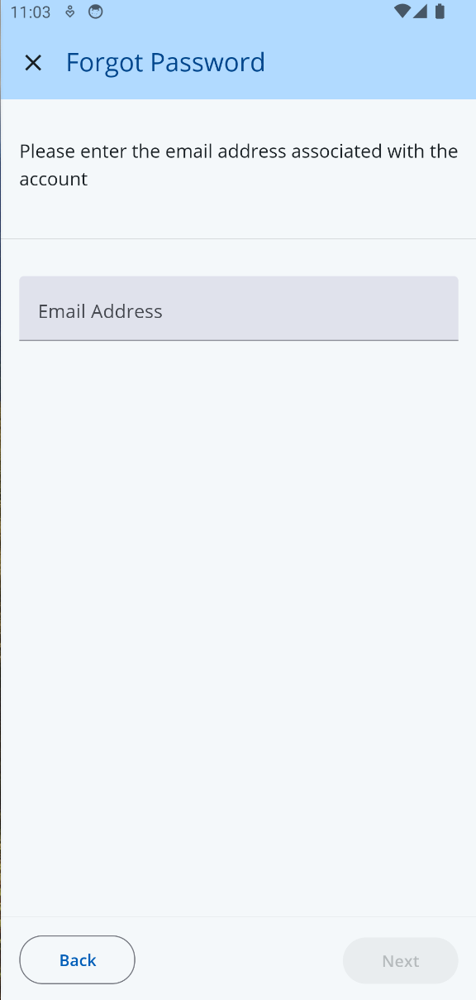

# ForgotPasswordScreen

A screen that collects an email address so a user who forgets their password can request a reset code. The ForgotPasswordScreen must be used within an `AuthContextProvider`.



## Usage

```tsx
import { AuthContextProvider, ForgotPasswordScreen } from '@brightlayer-ui/react-native-auth-workflow';
...

<AuthContextProvider {...props}>
    <ForgotPasswordScreen />
</AuthContextProvider>
```

## API

| Prop Name           | Type                                         | Description                                                                                                                                              | Default                                       |
| ------------------- | -------------------------------------------- | -------------------------------------------------------------------------------------------------------------------------------------------------------- | --------------------------------------------- |
| emailLabel          | `string`                                     | Text to display as the label for the email text field.                                                                                                   | `t('bluiAuth:FORGOT_PASSWORD.EMAIL_ADDRESS')` |
| initialEmailValue   | `string`                                     | The initial value for the email text field input.                                                                                                        |                                               |
| emailValidator      | `(email: string) => boolean \| string`       | A function that validates the email text field input.                                                                                                    | checks against valid email regex              |
| successScreen       | `JSX.Element`                                | Prop to pass SuccessScreen component                                                                                                                     |
| contactPhone        | `string`                                     | The phone number to display in the contact section.                                                                                                      | `1-800-123-4567`                              |
| responseTime        | `string`                                     | The response time to display in the contact section.                                                                                                     | `24 hours`                                    |
| description         | `(responseTime: string) => React.ReactNode;` | used to update the instruction                                                                                                                           |
| showSuccessScreen   | `boolean`                                    | If true, a success screen will appear after submitting the form                                                                                          | `true`                                        |
| errorDisplayConfig  | `ErrorManagerProps`                          | See [Error Management](../error-management.md)                                                                                                           |                                               |
| emailTextInputProps | `TextInputProps`                             | Props to pass to the email text input. See RNP's [TextInputProps API](https://callstack.github.io/react-native-paper/docs/components/TextInput/#props/). |                                               |

This screen also extends the `WorkflowCardProps` type for updating the title, instructions, buttons, etc. See [Workflow Card](../components/workflow-card.md) for more details.

-   **description** (optional)
    -   A function that returns the description to display in the contact section.
    -   **Type:** `(responseTime: string) => React.ReactNode`
    -   **Default:**
    ```tsx
    (responseTime: string): React.ReactNode => {
        return (
            <p>
                {t('bluiAuth:FORGOT_PASSWORD.DESCRIPTION', {
                    responseTime,
                })}
            </p>
        );
    };
    ```
