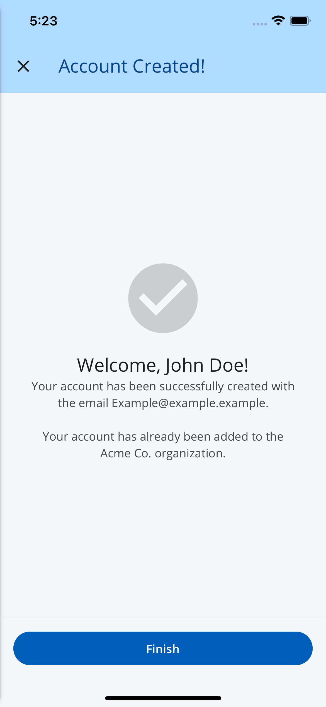

# RegistrationSuccessScreen

A full screen component that renders a success screen after completion of the registration process.



## Usage

```tsx
import { RegistrationSuccessScreen } from '@brightlayer-ui/react-native-auth-workflow';

...

<RegistrationSuccessScreen />
```

## API
<!-- TODO: Update the messageTitle and message type, after publishing @brightlayer-ui/react-native-components@8.0.2 -->
| Prop Name | Type | Description | Default |
|---|---|---|---|
| icon | [`IconSource`](https://github.com/etn-ccis/blui-react-native-component-library/blob/master/docs/Icons.md#icon-object) | The icon to be displayed on the screen. |  |
| messageTitle | `string` | The title of the success message. |  |
| message | `string` | The success message to be displayed on the screen. |  |
| dismissButtonLabel | `string` | The label of the dismiss button. |  |
| canDismiss | `boolean` | A boolean determining if the screen can be dismissed. |  |
| onDismiss | `() => void` | A function to be called when the screen is dismissed. |  |
| scrollMainContent | `boolean` | If true, the scroll view will be enabled for main content or else view will be enabled | false |

 Any other props will be provided to the `<SuccessScreen>` component ([**SuccessScreen**](./success.md)). 