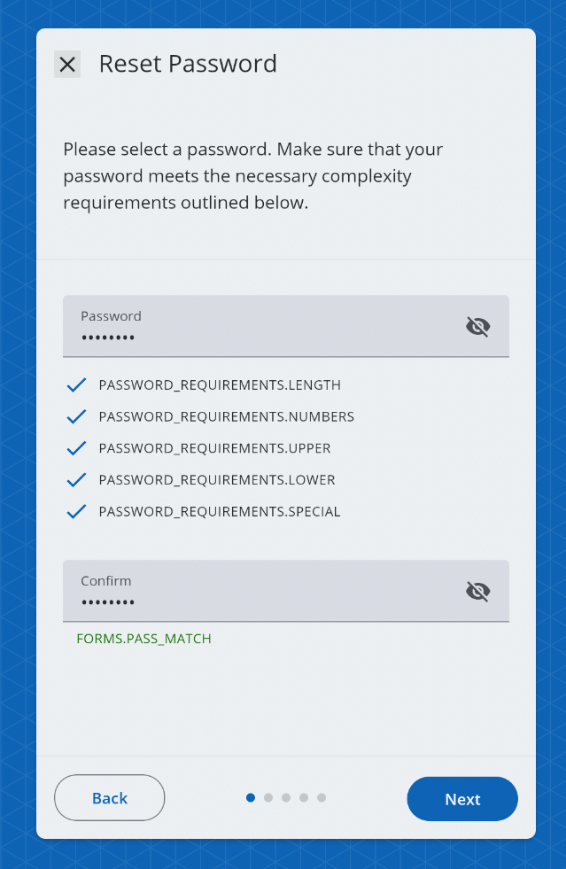

# ResetPasswordScreen

A screen that allows a user to reset their password. The ResetPasswordScreen must be used within an `AuthContextProvider`.



## Usage

```tsx
import { AuthContextProvider, ResetPasswordScreen } from '@brightlayer-ui/react-auth-workflow';
...

<AuthContextProvider {...props}>
    <ResetPasswordScreen />
</AuthContextProvider>
```

## API

| Prop Name          | Type                | Description                                                     | Default |
| ------------------ | ------------------- | --------------------------------------------------------------- | ------- |
| PasswordProps      | `SetPasswordProps`  | See [Set Password](../components/set-password.md)               |         |
| showSuccessScreen  | `boolean`           | If true, a success screen will appear after submitting the form | `true`  |
| successScreen      | `JSX.Element`       | Prop to pass SuccessScreen component                            |
| errorDisplayConfig | `ErrorManagerProps` | See [Error Management](../error-management.md)                  |         |

This screen also extends the `WorkflowCardProps` type for updating the title, instructions, buttons, etc. See [Workflow Card](../components/workflow-card.md) for more details.
