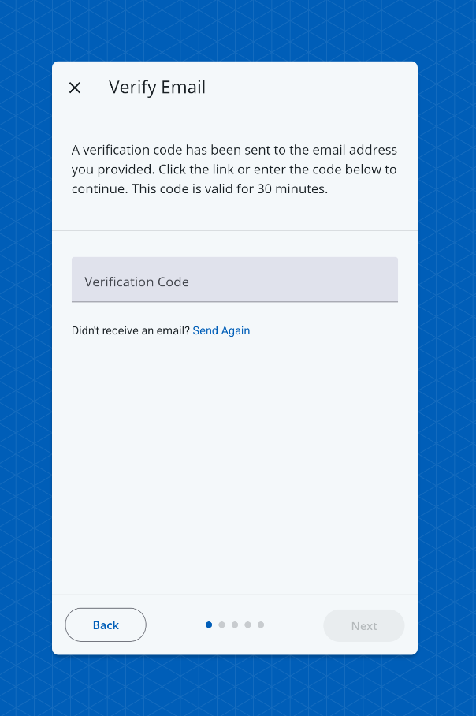

# VerifyCodeScreen

A screen that displays an input for a user to provide a verification code for the purposes of confirming an email address. The VerifyCodeScreen must be used within a `RegistrationContextProvider`.



## Usage

```tsx
import { RegistrationContextProvider, VerifyCodeScreen } from '@brightlayer-ui/react-native-auth-workflow';

...

<RegistrationContextProvider {...props}>
    <VerifyCodeScreen />
</RegistrationContextProvider>
```

## API

| Prop Name                | Type                                  | Description                                                                                                                                                             | Default                       |
| ------------------------ | ------------------------------------- | ----------------------------------------------------------------------------------------------------------------------------------------------------------------------- | ----------------------------- |
| codeValidator            | `(code: string) => boolean \| string` | A function to validate the input value                                                                                                                                  | required to be > 0 characters |
| onResend                 | `() => void`                          | A function that is called when the resend link/button is clicked.                                                                                                       |                               |
| resendInstructions       | `string`                              | Text to display ahead of the resend link/button.                                                                                                                        | `Didn't receive an email?`    |
| resendLabel              | `string`                              | Label/text for the resend link/button.                                                                                                                                  | `Send Again`                  |
| initialValue             | `string`                              | The initial value for the code input.                                                                                                                                   |                               |
| verifyCodeInputLabel     | `string`                              | The label for the code text field.                                                                                                                                      | `Verification Code`           |
| errorDisplayConfig       | `ErrorManagerProps`                   | See [Error Management](../error-management.md)                                                                                                                          |                               |
| verifyCodeTextInputProps | `TextInputProps`                      | Props to pass to the verify code text input. See React Native Paper's [TextInputProps API](https://callstack.github.io/react-native-paper/docs/components/TextInput/#textinput-props). |                               |

This screen also extends the `WorkflowCardProps` type for updating the title, instructions, buttons, etc. See [Workflow Card](../components/workflow-card.md) for more details.
